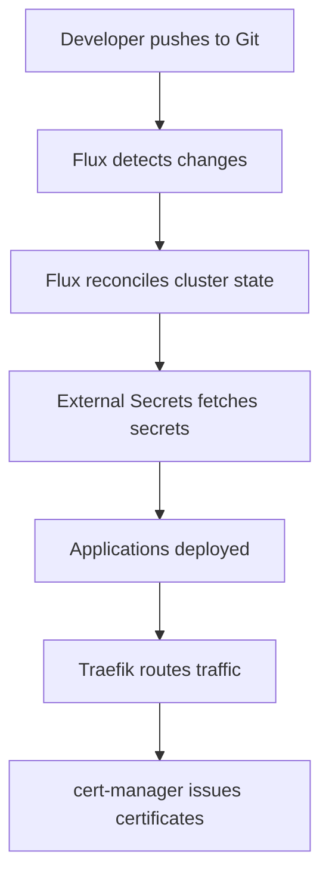

# Homelab GitOps Infrastructure

> **Fully automated, GitOps-based homelab for kragh.dev domain using k3s, Tailscale, External Secrets Operator, and Flux**

A complete infrastructure-as-code solution for a self-hosted homelab that provides secure, reproducible, and automated deployment of applications and services.

## 🏗️ Architecture

```raw
┌─────────────────┐    ┌─────────────────┐    ┌─────────────────┐
│   VPS Edge      │    │    Gigabyte     │    │    Beelink      │
│   (k3s agent)   │    │  (k3s server)   │    │  (k3s agent)    │
│                 │    │                 │    │                 │
│ - Public access │    │ - Control plane │    │ - Worker node   │
│ - Load balancer │    │ - GitOps        │    │ - Applications  │
└─────────────────┘    └─────────────────┘    └─────────────────┘
         │                       │                       │
         └───────────────────────┼───────────────────────┘
                                 │
                    ┌─────────────────┐
                    │   Tailscale     │
                    │  Mesh Network   │
                    │                 │
                    │ - Secure VPN    │
                    │ - Zero-config   │
                    │ - Auto-discovery│
                    └─────────────────┘
```

## 🔧 Technology Stack

### **Infrastructure**
- **Kubernetes**: k3s (lightweight Kubernetes distribution)
- **GitOps**: Flux CD (continuous deployment from Git)
- **Networking**: Tailscale (secure mesh VPN)
- **Ingress**: Traefik (reverse proxy and load balancer)
- **Secrets**: External Secrets Operator + Bitwarden
- **Encryption**: SOPS with Age encryption

### **Deployment**
- **Provisioning**: Ansible (infrastructure automation)
- **DNS**: Hetzner DNS (automated certificate management)
- **Storage**: Local storage with Restic backups

## 🚀 Quick Start

### Prerequisites
- 3x Linux servers (VPS + 2 local machines)
- Bitwarden account with API access
- Hetzner DNS API token
- Age encryption key

### 1. Bootstrap Infrastructure

```bash
# Clone the repository
git clone <your-repo-url>
cd homelab

# Generate Age encryption key
./scripts/generate-age-key.sh

# Configure secrets in Bitwarden and update ansible/secrets/homelab.yaml
# Run Ansible to provision cluster
cd ansible
ansible-playbook -i inventory/hosts.yaml site.yaml
```

### 2. Deploy Applications via GitOps

```bash
# Flux will automatically deploy everything from Git
# Check deployment status
kubectl get gitrepository -A
kubectl get kustomization -A
kubectl get helmrelease -A
```

## 📁 Project Structure

```raw
homelab/
├── ansible/                    # Infrastructure provisioning
│   ├── roles/
│   │   ├── base/              # Base system setup
│   │   ├── tailscale/         # Tailscale mesh networking
│   │   ├── k3s-control-plane/ # Kubernetes control plane
│   │   ├── k3s-worker-nodes/  # Kubernetes worker nodes
│   │   ├── k3s-edge-node/     # VPS edge node setup
│   │   └── gitops-bootstrap/  # Bootstrap secrets
│   ├── inventory/             # Server inventory
│   ├── secrets/               # SOPS-encrypted secrets
│   └── site.yaml             # Main playbook
│
├── clusters/homelab/          # Kubernetes manifests
│   ├── kustomization.yaml    # 🎯 Single GitOps entry point
│   ├── infrastructure/       # Infrastructure components
│   │   ├── external-secrets/ # Secret management
│   │   └── ingress/          # Traefik reverse proxy
│   └── apps/                 # Application deployments
│
├── scripts/                  # Utility scripts
├── docs/                     # Documentation
└── README.md                 # This file
```

## 🔐 Security & Secrets

### **Secret Management Strategy**
1. **Bootstrap Secret**: Bitwarden credentials stored in k3s `default` namespace (via Ansible)
2. **Dynamic Secrets**: All other secrets fetched from Bitwarden via External Secrets Operator
3. **Encryption**: All sensitive files encrypted with SOPS + Age

### **Key Security Features**
- ✅ SOPS encryption for all sensitive data
- ✅ External Secrets Operator for dynamic secret injection
- ✅ Tailscale mesh VPN for secure inter-node communication
- ✅ Automated TLS certificates via cert-manager + Hetzner DNS
- ✅ GitOps workflow prevents configuration drift

## 🏠 Applications

### **Infrastructure Services**
- **Traefik**: Reverse proxy and load balancer with IngressRoute CRD
- **External Secrets Operator**: Dynamic secret management with Bitwarden integration
- **cert-manager**: Automated TLS certificate management via Hetzner DNS
- **FluxCD**: GitOps continuous deployment from Git repository

### **Homelab Applications**

#### ✅ **Live Applications**
- **Portfolio Website**: Personal CV and portfolio at [kragh.dev](https://kragh.dev)
  - **Technology**: Static site with JSON Resume format
  - **Ingress**: Traefik IngressRoute with native load balancing
  - **Security**: Automated TLS certificates via Let's Encrypt
  - **Status**: Production-ready ✅

#### 🚧 **Planned Applications**
- **Home Assistant**: Smart home automation platform
- **Jellyfin**: Media server for movies, TV shows, and music
- **Nextcloud**: Self-hosted cloud storage and productivity suite
- **Vaultwarden**: Self-hosted Bitwarden-compatible password manager

## 📋 Todo List

### **Infrastructure ✅ Complete**
- [x] Complete Flux bootstrap automation in Ansible
- [x] Test GitOps reconciliation from Git repository
- [x] Implement cert-manager for automated TLS
- [x] Resolve cross-node networking with Traefik IngressRoute
- [x] Configure service-based load balancing for multi-node clusters

### **Infrastructure 🚧 In Progress**
- [ ] Rework Ansible roles since current setup doesn't work
- [ ] Set up automated backups with Restic
- [ ] Configure monitoring with Prometheus/Grafana
- [ ] Implement log aggregation and centralized logging

### **Applications**
- [x] **Portfolio Website**: Deploy personal website ✅
  - [x] Set up custom domain (kragh.dev)
  - [x] Configure static site hosting
  - [x] Implement automated TLS certificates
  - [x] Optimize Traefik routing with IngressRoute
- [ ] **Home Assistant**: Deploy smart home automation
  - [ ] Configure device integrations
  - [ ] Set up automation rules
  - [ ] Implement secure external access
- [ ] **Jellyfin Media Server**: Deploy media streaming
  - [ ] Configure media storage
  - [ ] Set up hardware transcoding
  - [ ] Configure user accounts and libraries
- [ ] **Nextcloud**: Deploy cloud storage
  - [ ] Configure persistent storage
  - [ ] Set up user accounts
  - [ ] Configure external access

### **Operations**
- [x] Document deployment procedures
- [x] Create comprehensive homelab documentation
- [ ] Create disaster recovery plan
- [ ] Set up log aggregation
- [ ] Implement security scanning
- [ ] Create maintenance schedules

### **Networking & Security ✅ Operational**
- [x] Configure Tailscale mesh networking
- [x] Implement secure cross-node communication
- [x] Set up automated TLS certificate management
- [x] Configure Traefik service-based load balancing
- [ ] Configure Tailscale exit nodes
- [ ] Set up VPN access for external devices
- [ ] Implement network segmentation
- [ ] Configure firewall rules
- [ ] Set up intrusion detection

## 🔄 GitOps Workflow



## 🌐 Networking & Load Balancing

### **Cross-Node Service Discovery**
The homelab uses a sophisticated networking setup to handle multi-node deployments across Tailscale mesh:

- **Challenge**: Flannel VXLAN backend over Tailscale doesn't support cross-node pod-to-pod traffic
- **Solution**: Traefik IngressRoute with `nativeLB: true` for service-based load balancing
- **Result**: Traffic flows through Kubernetes service VIPs instead of direct pod IPs

### **Traefik Configuration Highlights**

```yaml
apiVersion: traefik.io/v1alpha1
kind: IngressRoute
spec:
  routes:
    - services:
        - name: service-name
          nativeLB: true  # Forces service VIP routing
```

This ensures reliable cross-node communication without requiring duplicate services or complex networking workarounds.

## 🚨 Disaster Recovery

### **Backup Strategy**
- **Configuration**: Everything in Git (GitOps)
- **Secrets**: Stored in Bitwarden (external)
- **Data**: Automated Restic backups to multiple locations
- **Recovery**: Full cluster recreation from Ansible + Git

### **Recovery Steps**
1. Provision new infrastructure with Ansible
2. Restore from Git repository (automatic via Flux)
3. Secrets automatically restored from Bitwarden
4. Application data restored from Restic backups

## 📖 Documentation

- [Homelab Context](docs/HOMELAB_CONTEXT.md) - Comprehensive setup and architecture documentation
- [Troubleshooting Guide](docs/TROUBLESHOOTING.md) - Technical solutions and common issues
- [AI Assistant Prompt](docs/AI_ASSISTANT_PROMPT.md) - Quick context for AI assistants

## 🤝 Contributing

1. Fork the repository
2. Create a feature branch
3. Make changes and test locally
4. Submit a pull request

## 📄 License

This project is licensed under the MIT License - see the [LICENSE](LICENSE) file for details.

## 🙏 Acknowledgments

- [Flux CD](https://fluxcd.io/) for GitOps automation
- [External Secrets Operator](https://external-secrets.io/) for secret management
- [Tailscale](https://tailscale.com/) for secure networking
- [k3s](https://k3s.io/) for lightweight Kubernetes
- [SOPS](https://github.com/mozilla/sops) for secret encryption
