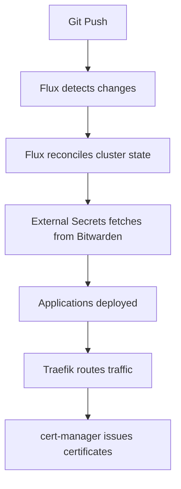

# Homelab Context & Setup Documentation

> **Generated on August 24, 2025** - Comprehensive context for AI assistants and new contributors

## Overview
This is a fully automated, GitOps-based homelab for the `kragh.dev` domain using k3s, Tailscale, External Secrets Operator, and FluxCD. The infrastructure follows infrastructure-as-code principles with proper secret management and security.

## Architecture

### Physical Infrastructure
- **3 machines** connected via Tailscale mesh network:
  - **Gigabyte** (192.168.50.16) - k3s control plane/server (local)
  - **Beelink** (192.168.50.220) - k3s worker node (local)  
  - **VPS Edge** (198.55.102.244) - k3s agent for public ingress (cloud)

### Network Topology

```text
┌─────────────────┐    ┌─────────────────┐    ┌─────────────────┐
│   VPS Edge      │    │    Gigabyte     │    │    Beelink      │
│   (k3s agent)   │    │  (k3s server)   │    │  (k3s agent)    │
│                 │    │                 │    │                 │
│ - Public access │    │ - Control plane │    │ - Worker node   │
│ - Load balancer │    │ - GitOps        │    │ - Applications  │
│ - Traefik edge  │    │ - Flux CD       │    │ - Local storage │
└─────────────────┘    └─────────────────┘    └─────────────────┘
         │                       │                       │
         └───────────────────────┼───────────────────────┘
                                 │
                    ┌─────────────────┐
                    │   Tailscale     │
                    │  Mesh Network   │
                    │ (100.x.x.x IPs) │
                    └─────────────────┘
```

## Technology Stack

### Core Infrastructure
- **Kubernetes**: k3s (lightweight distribution)
- **GitOps**: FluxCD v2 (continuous deployment from Git)
- **Networking**: Tailscale (secure mesh VPN)
- **Ingress**: Traefik v2 (reverse proxy and load balancer)
- **Secrets**: External Secrets Operator + Bitwarden
- **Encryption**: SOPS with Age encryption
- **DNS**: Hetzner DNS (automated certificate management)
- **Provisioning**: Ansible (infrastructure automation)

### Security Architecture
- **Secret Management**:
  - Bootstrap secret: Bitwarden credentials in k3s `default` namespace (via Ansible)
  - Dynamic secrets: All other secrets fetched from Bitwarden via External Secrets Operator
- **Encryption**: All sensitive files encrypted with SOPS + Age
- **Network**: Tailscale mesh VPN for secure inter-node communication
- **TLS**: Automated certificates via cert-manager + Hetzner DNS

## Project Structure

### `/ansible/` - Infrastructure Provisioning

```text
ansible/
├── site.yaml                    # Main playbook orchestrating all roles
├── inventory/
│   ├── hosts.yaml              # Server inventory (3 machines)
│   └── group_vars/all.yml      # Global variables
├── secrets/
│   └── homelab.yaml           # SOPS-encrypted secrets
└── roles/
    ├── base/                   # Base system setup (all nodes)
    ├── tailscale/             # Tailscale mesh networking
    ├── k3s-control-plane/     # Kubernetes control plane (gigabyte)
    ├── k3s-worker-nodes/      # Worker node setup (beelink)
    ├── k3s-edge-node/         # Edge node setup (vps)
    └── gitops-bootstrap/      # Flux CD bootstrap
```

### `/clusters/homelab/` - GitOps FluxCD Structure

```text
clusters/homelab/
├── kustomization.yaml          # 🎯 Single GitOps entry point
├── flux-kustomizations/        # Infrastructure deployment stages
│   ├── infrastructure-cert-manager.yaml
│   ├── infrastructure-external-secrets.yaml  
│   ├── infrastructure-secrets-config.yaml
│   ├── infrastructure-ingress.yaml
│   └── apps.yaml
├── infrastructure/             # Infrastructure components
│   ├── cert-manager/          # TLS certificate management
│   ├── external-secrets/      # Secret management
│   ├── config/                # Configuration maps
│   └── ingress/               # Traefik configuration
└── apps/                      # Application deployments
    └── json-resume/           # Personal CV/portfolio (kragh.dev)
```

## Deployment Dependencies & Order

FluxCD manages staged deployment with proper dependencies:

1. **cert-manager** (TLS certificates)
2. **config** (certificates & issuers) ← depends on cert-manager
3. **external-secrets** (secret management) ← depends on config
4. **secrets-config** (ClusterSecretStore) ← depends on external-secrets
5. **ingress** (Traefik) ← depends on secrets-config
6. **apps** (applications) ← depends on ingress

## Key Configuration Details

### Ansible Inventory (`ansible/inventory/hosts.yaml`)

```yaml
k3s_server:
  hosts:
    gigabyte:
      ansible_host: 192.168.50.16
      ansible_user: chkpe

k3s_agents:
  hosts:
    beelink:
      ansible_host: 192.168.50.220
      ansible_user: chkpe

edge:
  hosts:
    vhs-vps:
      ansible_host: 198.55.102.244
      ansible_user: root
```

### Traefik Configuration
- **Edge deployment**: Runs on VPS with `node.kubernetes.io/edge: "true"`
- **Public IP**: 198.55.102.244 exposed via NodePort
- **Ports**: 80 (→30080), 443 (→30443)
- **Dashboard**: `traefik.kragh.dev`
- **ACME**: Let's Encrypt with HTTP challenge

### Domain & DNS
- **Primary domain**: `kragh.dev`
- **Applications**:
  - `kragh.dev` → json-resume (personal CV)
  - `traefik.kragh.dev` → Traefik dashboard
- **DNS provider**: Hetzner DNS with API automation

## Current Applications

### ✅ Deployed
- **JSON Resume**: Personal CV/portfolio at `kragh.dev`
  - Namespace: `json-resume`  
  - Ingress: Traefik with automatic TLS
  - Service: Internal ClusterIP

### 🚧 Planned (from README)
- **Home Assistant**: Smart home automation platform
- **Jellyfin**: Media server for movies, TV shows, and music
- **Nextcloud**: Self-hosted cloud storage and productivity suite
- **Vaultwarden**: Password manager (migrate from Bitwarden cloud)
- **Restic**: Automated backup solution

## GitOps Workflow



## Secret Management Strategy

1. **Bootstrap Phase**:
   - Ansible creates Bitwarden access token secret in `default` namespace
   - This enables External Secrets Operator to authenticate

2. **Runtime Phase**:
   - External Secrets Operator fetches all secrets from Bitwarden
   - Secrets automatically injected into applications
   - No secrets stored in Git (only references)

3. **Encryption**:
   - All Ansible secrets encrypted with SOPS + Age
   - Age key stored securely outside repository

## Important Files & Locations

### Entry Points
- **Ansible**: `ansible/site.yaml` - Main provisioning playbook
- **GitOps**: `bootstrap.yaml` - Single entry point for Flux bootstrap
- **Cluster Config**: `clusters/homelab/kustomization.yaml` - Root cluster configuration

### Key Configurations
- **Traefik**: `clusters/homelab/infrastructure/ingress/traefik-helmrelease.yaml`
- **External Secrets**: `clusters/homelab/infrastructure/external-secrets/`
- **Applications**: `clusters/homelab/apps/`

### Security
- **Encrypted secrets**: `ansible/secrets/homelab.yaml` (SOPS)
- **Age key**: Generated by `scripts/generate-age-key.sh`

## Disaster Recovery

### Backup Strategy
- **Configuration**: Everything in Git (GitOps principle)
- **Secrets**: Stored in Bitwarden (external, redundant)
- **Application data**: Planned Restic backups to multiple locations

### Recovery Steps
1. Provision new infrastructure with Ansible (`ansible/site.yaml`)
2. Flux automatically restores from Git repository
3. External Secrets automatically restores secrets from Bitwarden  
4. Application data restored from Restic backups (when implemented)

## Operational Commands

### Ansible (Infrastructure)

```bash
cd ansible
ansible-playbook -i inventory/hosts.yaml site.yaml
```

### Kubernetes (Monitoring)

```bash
# Check GitOps status
kubectl get gitrepository -A
kubectl get kustomization -A  
kubectl get helmrelease -A

# Check applications
kubectl get pods -A
kubectl get ingress -A
```

### FluxCD (Troubleshooting)

```bash
# Force reconciliation
flux reconcile source git homelab
flux reconcile kustomization homelab-cluster

# Check status
flux get all
```

## Development Notes

### Adding New Applications
1. Create manifests in `clusters/homelab/apps/<app-name>/`
2. Add to `clusters/homelab/apps/kustomization.yaml`
3. Git commit → Flux automatically deploys

### Infrastructure Changes  
1. Modify files in `clusters/homelab/infrastructure/`
2. Respect dependency order (cert-manager → config → external-secrets → secrets-config → ingress)
3. Test in staging environment first

### Secret Management
1. Add secrets to Bitwarden
2. Create ExternalSecret resource referencing Bitwarden item
3. Application automatically receives secret via Kubernetes Secret

## Contact & Ownership
- **Domain**: kragh.dev
- **Owner**: chkpe
- **Repository**: <https://github.com/tonur/homelab>
- **Email**: <contact@kragh.dev>

---

## AI Assistant Usage

When helping with this homelab:

1. **Always check current state** before making changes
2. **Respect GitOps principles** - changes should go through Git
3. **Follow dependency order** for infrastructure components
4. **Use proper namespaces** and resource naming conventions
5. **Consider security implications** of any changes
6. **Test changes locally** when possible before applying

This homelab represents a production-grade setup with proper security, automation, and operational practices. Treat it accordingly.

## Bootstrap Process

The homelab uses a **two-phase bootstrap approach**:

### Phase 1: Infrastructure Bootstrap (Ansible)
1. **Provision machines**: Base system setup + Tailscale mesh networking
2. **Deploy k3s**: Control plane, worker nodes, and edge node
3. **GitOps bootstrap**: Apply `bootstrap.yaml` to create:
   - `flux-system` namespace
   - GitRepository pointing to this repo
   - Root Kustomization for `./clusters/homelab`

### Phase 2: Application Bootstrap (Flux)
1. **Flux takes over**: Applies all configs from `clusters/homelab/`
2. **Staged deployment**: Following dependency order (cert-manager → config → external-secrets → etc.)
3. **Secret management**: External Secrets Operator fetches secrets from Bitwarden
4. **Applications**: Deploy all applications defined in `apps/`

### Key Files
- **`bootstrap.yaml`**: Single entry point applied by Ansible
- **`clusters/homelab/kustomization.yaml`**: Root cluster configuration
- **`ansible/roles/gitops-bootstrap/`**: Applies bootstrap.yaml and creates initial secrets
